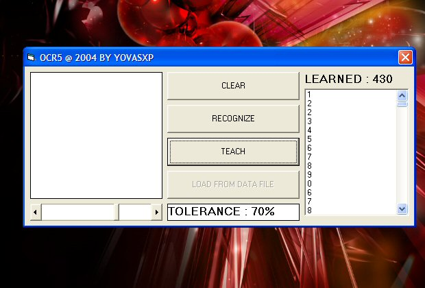

## SIMPLE & EFFECTIVE OCR \(UPDATE: NOW IN ENGLISH\)

### Description

THIS SIMPLE PROGRAM CAN RECOGNIZE CHARACTERS THAT YOU "TEACH" TO IT. IS VERY SIMPLE BUT WORKS WELL.

ABOUT UPDATE:

OK FINALLY COMMENTS ARE IN ENGLISH BUT REMEMBER THAT IS NOT SO GOOD.

NOW YOU CAN SEE THE CHARS YOU HAVE TEACHED TO IT.

VOTE IF YOU LIKE IT!
 
### More Info
 

             |
---                |---
**Submitted On**   |2004-03-27 15:12:12
**By**             |[Geovany Andres Villegas](https://github.com/Planet-Source-Code/PSCIndex/blob/master/ByAuthor/geovany-andres-villegas.md)
**Level**          |Intermediate
**User Rating**    |4.8 (24 globes from 5 users)
**Compatibility**  |VB 5\.0, VB 6\.0
**Category**       |[Miscellaneous](https://github.com/Planet-Source-Code/PSCIndex/blob/master/ByCategory/miscellaneous__1-1.md)
**World**          |[Visual Basic](https://github.com/Planet-Source-Code/PSCIndex/blob/master/ByWorld/visual-basic.md)
**Archive File**   |[SIMPLE\_&\_E1725313272004\.zip](https://github.com/Planet-Source-Code/geovany-andres-villegas-simple-effective-ocr-update-now-in-english__1-52555/archive/master.zip)

